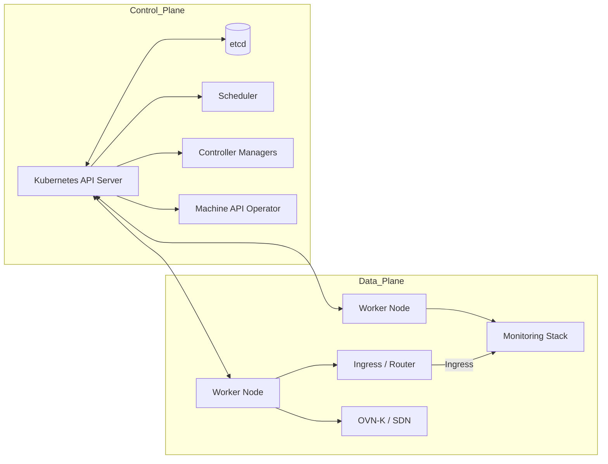
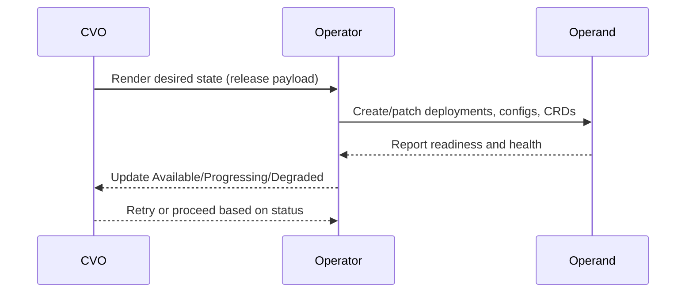

# Module 01: OpenShift 4 Architecture

## Overview

Understand how OpenShift 4 is assembled, what runs where, and why the platform favors immutable nodes. This module
connects Kubernetes concepts to OpenShift components so operators can navigate clusters with confidence.

## Learning Objectives

- Distinguish control plane responsibilities from data plane workloads in OpenShift.
- Explain how RHCOS and Ignition deliver immutable nodes and why SSH access is discouraged.
- Interpret Cluster Operator health states and their impact on the platform.
- Locate critical platform components inside `openshift-*` namespaces.

## Prerequisites

- Working `oc` CLI with access to an OpenShift 4 cluster (lab or sandbox).
- Familiarity with core Kubernetes objects (Pods, Deployments, DaemonSets).
- Ability to read basic CLI output and YAML resources.

## Content

### Control plane vs. data plane

- **Control plane**: API Server, etcd, Scheduler, Controller Managers, OAuth server, and the Machine API Operator. These
  components run on control-plane nodes and expose the Kubernetes API, enforce desired state, and manage node lifecycle.
- **Data plane**: Worker nodes that host user workloads plus platform services such as ingress, logging, and monitoring
  stacks. Data-plane services rely on the control plane for desired state and configuration.

### RHCOS, Ignition, and immutable infrastructure

- **RHCOS**: A minimal, container-optimized OS with transactional updates and no package manager for ad-hoc installs.
- **Ignition**: One-time, early-boot configuration that wires nodes into the cluster with the right roles, SSH keys (if
  allowed), and systemd units.
- **Immutable by design**: Nodes are rebuilt from Ignition or updated via MachineConfig Pools instead of manual tweaks.
  Drift is eliminated by re-provisioning rather than patching in place.

> **Real-world story:** Teams accustomed to SSHing into RHEL nodes hit permission denied messages on RHCOS workers. The
> platform team stopped enabling SSH except for break-glass scenarios because manual edits broke MachineConfig
> reconciliation and led to inconsistent kubelet configs across nodes.

### Cluster Operators

- Operators are reconciliation loops that install and maintain OpenShift components (API, ingress, image registry, OVN,
  monitoring, etc.).
- The Cluster Version Operator (CVO) coordinates them during installs and upgrades.
- Health summary:
  - **Available**: The operand is running and serving.
  - **Progressing**: The operator is rolling out changes (upgrades, new resources, resyncing).
  - **Degraded**: The operator cannot reconcile desired state; intervention is required before upgrades.

### `openshift-*` namespaces

- **Core control plane services**: `openshift-apiserver`, `openshift-oauth-apiserver`, `openshift-kube-apiserver`,
  `openshift-etcd`.
- **Networking**: `openshift-ingress`, `openshift-ingress-operator`, `openshift-network-node`, `openshift-ovn-kubernetes`
  or `openshift-sdn`.
- **Machine lifecycle**: `openshift-machine-api`, `openshift-machine-config-operator`.
- **Registry and images**: `openshift-image-registry`, `openshift-cluster-samples-operator`.
- **Observability**: `openshift-monitoring`, `openshift-logging` (if installed), `openshift-insights`.
- **Workload isolation**: Platform components stay in `openshift-*` namespaces; user projects should not live here.

## Hands-On Lab

Work through the lab steps in [lab.md](./lab.md) to inspect cluster components, operator health, and MachineConfig
Pools.

## Validation

- Confirm you can list the cluster version, operators, nodes, MachineConfig Pools, and `openshift-*` namespaces as shown
  in the lab.
- Ensure no operators report `Degraded=True` before proceeding to the next module.

## Troubleshooting

See [troubleshooting.md](./troubleshooting.md) for common issues encountered while inspecting cluster health.

## Additional Resources

- Official references in [references.md](./references.md).
- Continue with the Module 01 quiz in [quiz.md](./quiz.md).
