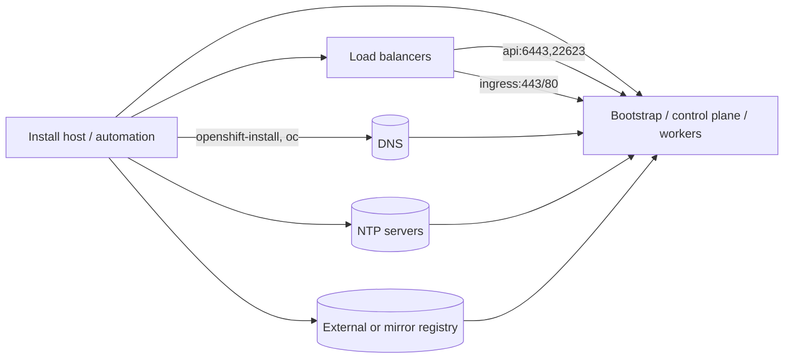

# Module 00: Day-0 Prerequisites

## Overview

Plan the foundational requirements for a successful OpenShift 4.x installation. This module covers the
infrastructure services that must be ready before running the installer so clusters come up reliably.

## Learning Objectives

- Map required DNS entries for API and application ingress.
- Validate load balancer front ends, health checks, and required ports.
- Confirm clock synchronization and understand its impact on certificates and etcd.
- Choose an appropriate topology (HA, compact, or SNO) with right-sized nodes.
- Prepare certificate strategy and custom trust bundles.
- Outline a disconnected/mirror registry approach for image availability.

## Prerequisites

- Familiarity with Linux CLI, `oc`, and basic networking tools (`dig`, `curl`, `nc`).
- Ability to create or request DNS records and load balancer listeners.
- Access to NTP/time sources and (optionally) a container registry for mirroring.

## Topology and Sizing

- **Highly Available (HA):** 3 control plane + ≥2 workers. Typical starting size: 4 vCPU / 16–32 GB RAM per
  control plane, 4–8 vCPU / 16–32 GB RAM per worker.
- **Compact Cluster:** 3 control plane nodes that also run workloads. Start with 8 vCPU / 32–64 GB RAM per
  node; good for edge or small footprints.
- **Single Node OpenShift (SNO):** 1 node running control and workloads. Requires robust hardware
  (16–32 vCPU, 64–128 GB RAM, fast disks).
- Plan storage: fast SSD/NVMe for etcd; separate disks or LVM for workload volumes when possible.

## DNS Requirements

- **API endpoint:** `api.<CLUSTER_NAME>.<DOMAIN>` -> points to the API load balancer (or bootstrap/control
  plane in small labs).
- **Internal API:** `api-int.<CLUSTER_NAME>.<DOMAIN>` -> resolves to control plane nodes (used by nodes and
  bootstrap).
- **Apps wildcard:** `*.apps.<CLUSTER_NAME>.<DOMAIN>` -> points to the ingress load balancer.
- Example (`CLUSTER_NAME=ocp4`, `DOMAIN=example.com`):
  - `api.ocp4.example.com` -> 203.0.113.10 (API LB VIP)
  - `api-int.ocp4.example.com` -> 10.10.0.11, 10.10.0.12, 10.10.0.13 (control plane nodes)
  - `*.apps.ocp4.example.com` -> 203.0.113.20 (ingress LB VIP)
- Ensure forward and reverse records exist where required by your platform.

## Load Balancer Requirements

- Separate front ends for API and application ingress are recommended.
- **API/etcd:** TCP 6443 (Kubernetes API) and TCP 22623 (Machine Config Server) to control plane nodes.
- **Ingress:** TCP 443/80 to ingress controllers (typically worker or all nodes in compact/SNO).
- Health checks:
  - API: HTTPS `https://<api>/readyz` or TCP 6443.
  - Ingress: HTTPS to `https://<hostname>/.well-known/health` (router) or TCP 443.
- Preserve client source IP only if required by apps; otherwise SNAT is acceptable.

## Time Synchronization (NTP/chrony)

- All nodes (including bootstrap) must use a reliable, consistent time source.
- Clock drift breaks TLS handshakes, etcd quorum, and OAuth token validity.
- Configure chrony with reachable upstream servers or an internal NTP stratum; ensure ports UDP 123 are open.

## Certificates and Trust

- Default ingress certificates are cluster-managed; customize with a wildcard cert for `*.apps` when needed.
- Provide a custom CA trust bundle during install via `additionalTrustBundle` in `install-config.yaml` so all
  nodes trust internal proxies, registries, or TLS intercept devices.
- Plan renewal cadence for custom certs (ingress and registry) to avoid outages.

## Disconnected and Mirror Registry Planning

- Identify an internal, reachable registry (with sufficient storage) to mirror release and operator images.
- Use `oc adm release mirror` to populate the mirror registry; ensure pull secret includes mirror credentials.
- Keep the mirror in sync with desired OpenShift releases and CatalogSources; document imageContentSources in
  `install-config.yaml`.

## Preflight Checklist

| Item | What to verify | Command / How | Expected outcome |
| --- | --- | --- | --- |
| DNS | `api`, `api-int`, `*.apps` resolve to correct VIPs/hosts | `dig +short api.${CLUSTER_NAME}.${DOMAIN}` | Returns IPs for API VIP or control plane nodes |
| Load balancers | Ports 6443, 22623, 443, 80 reachable from installer network | `nc -zv api.${CLUSTER_NAME}.${DOMAIN} 6443` | Connection succeeds on required ports |
| Time sync | Nodes use reachable NTP sources | `chronyc tracking` | Reported stratum and low offset (<100 ms) |
| Certificates | Custom CA bundle available if required | Inspect `install-config.yaml` `additionalTrustBundle` | Bundle present and matches internal endpoints |
| Registry access | External or mirror registry reachable | `podman login ${REGISTRY}` | Auth succeeds and push/pull allowed |
| Sizing/topology | Node counts and hardware match chosen architecture | Compare to sizing above | Hardware plan approved |

## Components and External Dependencies

## Hands-On Lab

Follow the lab steps in [lab.md](./lab.md) to validate prerequisites with copy-paste friendly commands.

## Troubleshooting

Common remediation steps are documented in [troubleshooting.md](./troubleshooting.md).

## Additional Resources

Official references are listed in [references.md](./references.md).
